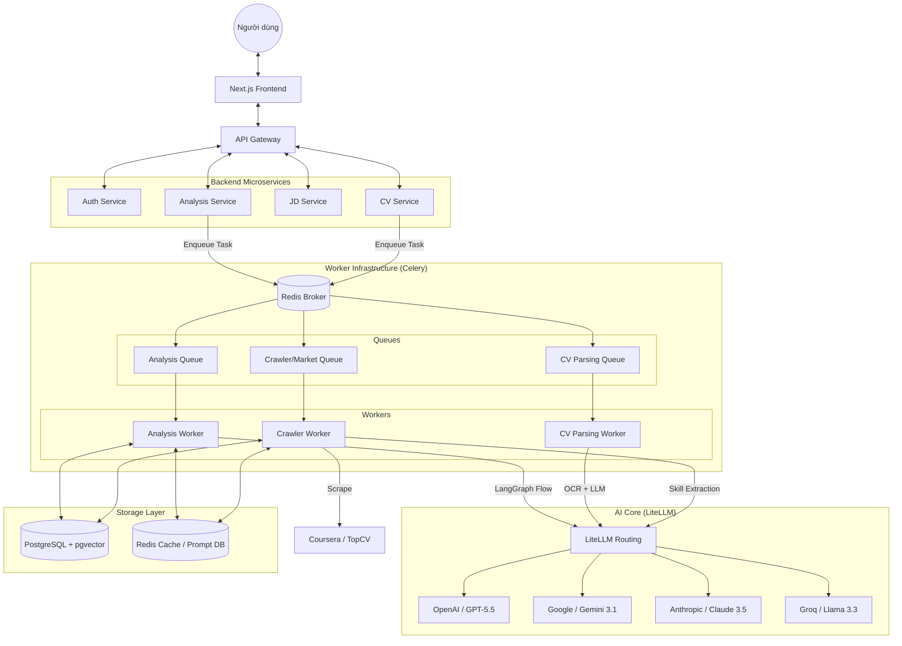

# Kiến Trúc Hệ Thống Leveller.ai

Leveller.ai là một nền tảng phân tích CV và gợi ý lộ trình nghề nghiệp thông minh dựa trên kiến trúc Microservices hiện đại, kết hợp với sức mạnh của AI (LLM) và Vector Search.

---

## 1. Tổng Quan Hệ Thống

Hệ thống được thiết kế để giải quyết bài toán:
- **Phân tích CV**: Trích xuất kỹ năng, kinh nghiệm và trình độ từ hồ sơ ứng viên (hỗ trợ cả file scan/ảnh qua OCR).
- **Phân tích Lỗ hổng (Gap Analysis)**: So khớp năng lực hiện tại với yêu cầu thị trường thông qua Vector Similarity.
- **Gợi ý Lộ trình**: Đề xuất các khóa học và công việc phù hợp nhất để lấp đầy các lỗ hổng kỹ năng.

---

## 2. Kiến Trúc Dịch Vụ (Microservices)

Hệ thống bao gồm các dịch vụ chính chạy độc lập trong Docker containers:

### A. API Gateway
- **Công nghệ**: FastAPI / Uvicorn.
- **Vai trò**: Điểm tiếp nhận duy nhất cho mọi request từ Frontend. Thực hiện định tuyến (routing) đến các service nội bộ và xử lý CORS.

### B. Core Services
- **Auth Service**: Quản lý người dùng, đăng ký, đăng nhập (JWT) và phân quyền (RBAC).
- **CV Service**: Quản lý hồ sơ CV, lưu trữ metadata và trạng thái xử lý.
- **JD Service**: Quản lý mô tả công việc (Job Descriptions) và dữ liệu thị trường.
- **Analysis Service**: "Bộ não" tính toán. Chứa logic tính toán Match Score, Growth Potential và Skill Gaps.
- **Recommender Service**: Thực hiện Vector Search để tìm kiếm khóa học (Courses) và công việc (Jobs) tương quan nhất.
- **Admin Service**: Cung cấp các công cụ quản trị, nạp dữ liệu (seeding), cấu hình hệ thống và theo dõi logs.

---

## 3. Hệ Thống Xử Lý Bất Đồng Bộ (Workers)

Sử dụng **Celery** và **Redis** để xử lý các tác vụ nặng mà không làm nghẽn giao diện:

- **worker_analysis**: Thực hiện phân tích AI chuyên sâu, tính toán roadmap.
- **worker_parsing**: Chuyên trách bóc tách CV (Parsing) sử dụng LangGraph và LLM.
- **worker_crawler**: Cào dữ liệu từ các nguồn bên ngoài (TopCV, Coursera).
- **worker_email**: Gửi thông báo, xác nhận qua email.
- **worker_benchmark**: Đánh giá hiệu năng và độ chính xác của các mô hình AI.

---

## 4. Công Nghệ AI & Dữ Liệu

### A. AI Orchestration (LangGraph)
Hệ thống không gọi LLM một cách đơn lẻ mà sử dụng **LangGraph** để điều phối các tác vụ phức tạp (ví dụ: Parsing CV qua nhiều bước kiểm định).

### B. Vector Search (pgvector)
- Sử dụng extension `pgvector` trên PostgreSQL để lưu trữ và tìm kiếm vector embeddings (1536 chiều từ OpenAI).
- Cho phép tìm kiếm ngữ nghĩa (Semantic Search) thay vì chỉ tìm theo từ khóa chính xác.

### C. LLM Engines
- **GPT-4o**: Sử dụng cho các tác vụ cần độ chính xác cao nhất (Parsing CV).
- **GPT-4o-mini**: Sử dụng cho các tác vụ phân tích nhanh và tiết kiệm chi phí.

---

## 5. Luồng Dữ Liệu (Data Flow)

### 5. Luồng Dữ Liệu Chính (Data Flow)
1.  **Ingestion**: Người dùng upload CV (PDF/Image).
2.  **Parsing**: Worker sử dụng OCR (Chandra Engine) và LLM (via LiteLLM) để chuyển đổi CV thành JSON.
3.  **Embedding**: Chuyển đổi kỹ năng trong CV thành Vector 1536 chiều (OpenAI/Gemini).
4.  **Matching**: So sánh Vector CV với Vector Jobs/Courses trong Database sử dụng `pgvector`.
5.  **Analytics**: Tính toán Match Score và Salary Impact dựa trên dữ liệu thị trường thực tế.
6.  **Presentation**: Trả kết quả về Frontend hiển thị Radar Chart và Roadmap.

---

## 6. Kiến Trúc Chi Tiết (Technical Deep-Dive)

### 6.1. AI Core & LiteLLM Integration
Hệ thống sử dụng **LiteLLM** làm lớp trừu tượng (Abstraction Layer) cho toàn bộ các cuộc gọi AI. Điều này mang lại các lợi thế:
-   **Multi-Provider**: Hỗ trợ đồng thời OpenAI, Google Gemini, Anthropic, DeepSeek, Groq.
-   **Model Registry**: Quản lý tập trung các model từ đời cũ đến các model mới nhất năm 2026 (GPT-5.5, Gemini 3.1).
-   **Automatic Fallback**: Tự động chuyển đổi sang model dự phòng nếu model chính bị lỗi hoặc hết hạn mức (Quota).
-   **Quota Management**: Kiểm soát lượng token tiêu thụ theo từng người dùng trong ngày.

### 6.2. Worker & Queue System (Celery)
Hệ thống phân tách tác vụ qua các Queue riêng biệt để tối ưu hiệu suất:
-   **`analysis` queue**: Xử lý tính toán Gap Analysis v3 (LangGraph Orchestrator).
-   **`cv_parsing` queue**: Chuyên trách bóc tách CV bằng OCR và LLM.
-   **`market_stats` queue**: Chạy các tác vụ Crawler (TopCV, Coursera) và tính toán thống kê thị trường hàng ngày.
-   **`benchmark` queue**: Đánh giá hiệu suất và độ chính xác của các model AI.

### 6.3. Sơ Đồ Kiến Trúc (Mermaid Diagram)

---

## 7. Danh Mục Công Nghệ (Tech Stack)

| Thành phần | Công nghệ |
| :--- | :--- |
| **Backend** | Python 3.10+, FastAPI, SQLAlchemy |
| **Frontend** | Next.js 14, TypeScript, TailwindCSS |
| **Asynchronous** | Celery, Redis |
| **Database** | PostgreSQL + pgvector |
| **AI/LLM** | OpenAI, Gemini, Claude, LiteLLM, LangGraph |
| **DevOps** | Docker, Docker Compose |
| **OCR** | Chandra Engine |

---

*© 2026 Leveller.ai - 078 Team - A20 AI Thực Chiến*
