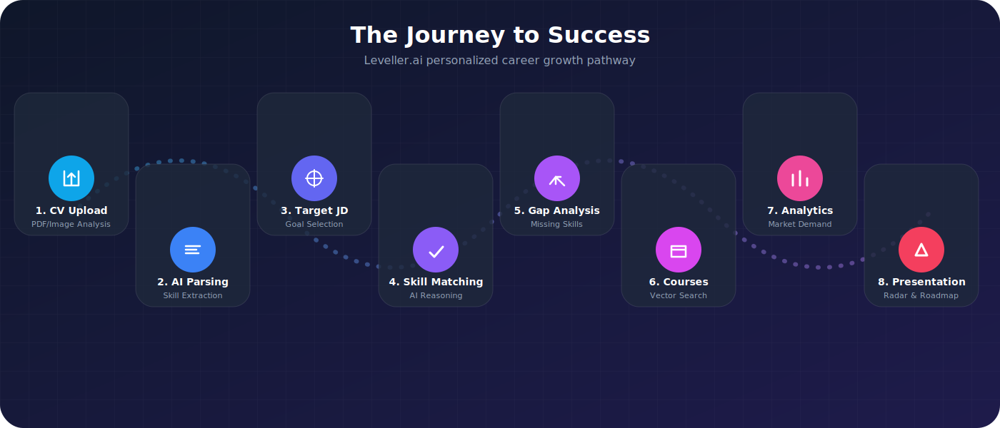
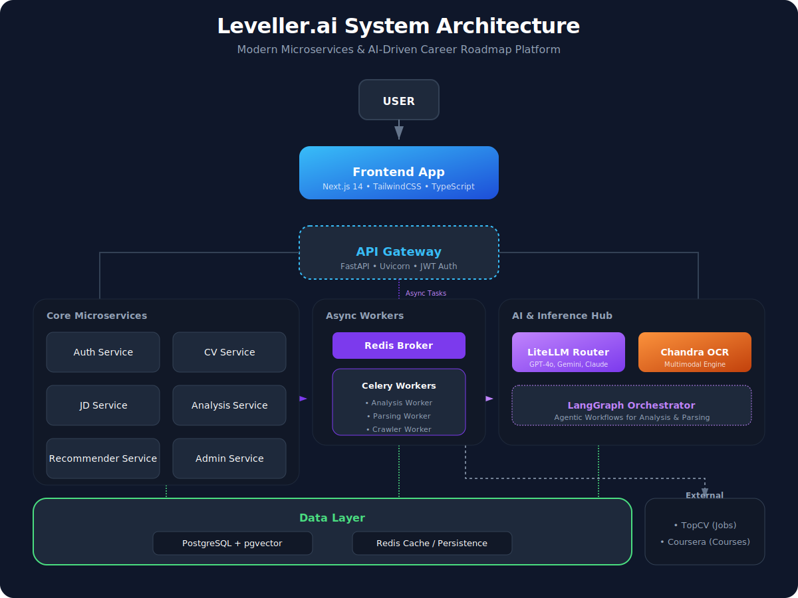
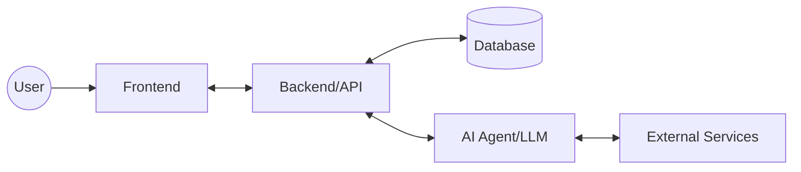
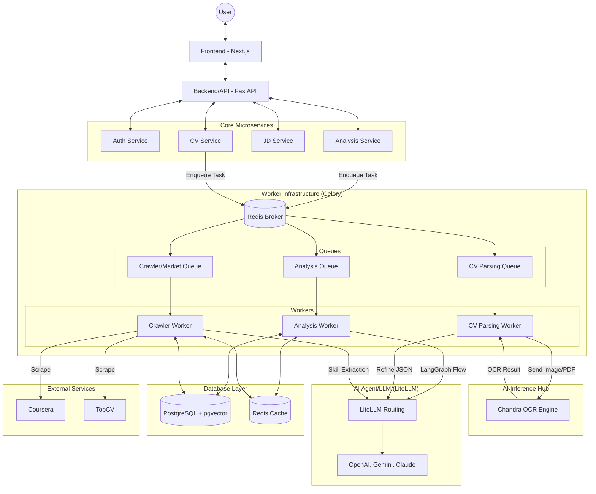

# Kiến Trúc Hệ Thống: Phân Tích Khoảng Trống Kỹ Năng & Gợi Ý Chứng Chỉ (Leveller.ai)

Leveller.ai là nền tảng chuyên sâu về **Phân Tích Khoảng Trống Kỹ Năng (Skill Gap Analysis)** và **Gợi Ý Lộ Trình Chứng Chỉ (Certificate Suggestion)**. Hệ thống được xây dựng trên kiến trúc Microservices hiện đại, kết hợp sức mạnh của AI Reasoning và Vector Search để tối ưu hóa lộ trình sự nghiệp.

---

## 1. Tổng Quan Hệ Thống

Hệ thống tập trung giải quyết bài toán:
- **Phân tích Năng lực (Profile Parsing)**: Trích xuất chính xác bộ kỹ năng và kinh nghiệm từ CV (hỗ trợ OCR cho file scan/ảnh).
- **Phân tích Khoảng trống (Gap Analysis)**: So khớp năng lực hiện tại với yêu cầu chi tiết từ **Job Description (JD)** bằng LLM Reasoning và Vector Similarity để chỉ ra các kỹ năng còn thiếu.
- **Gợi ý Chứng chỉ & Lộ trình (Recommendations)**: Đề xuất các chứng chỉ chuyên môn, khóa học và project thực tế phù hợp nhất để lấp đầy khoảng trống kỹ năng.

---

## 2. Kiến Trúc Dịch Vụ (Microservices)

Hệ thống bao gồm các dịch vụ chính chạy độc lập trong Docker containers:

### A. API Gateway
- **Công nghệ**: FastAPI / Uvicorn.
- **Vai trò**: Điểm tiếp nhận duy nhất cho mọi request từ Frontend. Thực hiện định tuyến (routing) đến các service nội bộ và xử lý CORS.

### B. Core Services
- **Auth Service**: Quản lý người dùng, đăng ký, đăng nhập (JWT) và phân quyền (RBAC).
- **CV Service**: Quản lý hồ sơ CV, lưu trữ metadata và trạng thái xử lý.
- **JD Service**: Quản lý mô tả công việc (Job Descriptions) và dữ liệu thị trường.
- **Analysis Service**: "Bộ não" tính toán. Chứa logic tính toán Match Score, Growth Potential và Skill Gaps.
- **Recommender Service**: Thực hiện Vector Search để tìm kiếm khóa học (Courses) và công việc (Jobs) tương quan nhất.
- **Admin Service**: Cung cấp các công cụ quản trị, nạp dữ liệu (seeding), cấu hình hệ thống và theo dõi logs.

---

## 3. Hệ Thống Xử Lý Bất Đồng Bộ (Workers)

Sử dụng **Celery** và **Redis** để xử lý các tác vụ nặng mà không làm nghẽn giao diện:

- **worker_analysis**: Thực hiện phân tích AI chuyên sâu, tính toán roadmap.
- **worker_parsing**: Chuyên trách bóc tách CV (Parsing) sử dụng LangGraph và LLM.
- **worker_crawler**: Cào dữ liệu từ các nguồn bên ngoài (TopCV, Coursera).
- **worker_email**: Gửi thông báo, xác nhận qua email.
- **worker_benchmark**: Đánh giá hiệu năng và độ chính xác của các mô hình AI.

---

## 4. Công Nghệ AI & Dữ Liệu

### A. AI Orchestration (LangGraph)
Hệ thống không gọi LLM một cách đơn lẻ mà sử dụng **LangGraph** để điều phối các tác vụ phức tạp (ví dụ: Parsing CV qua nhiều bước kiểm định).

### B. Vector Search (pgvector)
- Sử dụng extension `pgvector` trên PostgreSQL để lưu trữ và tìm kiếm vector embeddings (1536 chiều từ OpenAI).
- Cho phép tìm kiếm ngữ nghĩa (Semantic Search) thay vì chỉ tìm theo từ khóa chính xác.

### C. LLM Engines
- **GPT-4o**: Sử dụng cho các tác vụ cần độ chính xác cao nhất (Parsing CV).
- **GPT-4o-mini**: Sử dụng cho các tác vụ phân tích nhanh và tiết kiệm chi phí.

---

## 5. Luồng Dữ Liệu (Data Flow)

### 5. Luồng Dữ Liệu & Hành trình Người dùng (User Journey)

1.  **Ingestion**: Người dùng upload CV (PDF/Image/Docx).
2.  **Parsing**: Worker sử dụng OCR (Chandra Engine) và LLM (via LiteLLM) để chuyển đổi CV thành JSON.
3.  **JD Selection**: Người dùng lựa chọn Job Description (JD) mục tiêu trong hệ thống hoặc tự nhập JD tùy ý.
4.  **Skill Matching**: So khớp bộ kỹ năng từ CV với yêu cầu của JD đã chọn sử dụng **LLM Reasoning** để đánh giá mức độ tương quan sâu về ngữ nghĩa, trình độ và kinh nghiệm thực tế.
5.  **Gap Analysis**: Xác định các kỹ năng còn thiếu (Skill Gaps) mà người dùng cần bổ sung để đạt yêu cầu của JD.
6.  **Recommendation**: Tìm kiếm các khóa học (Courses) phù hợp nhất thông qua **Vector Similarity** (Semantic Search) để lấp đầy chính xác các khoảng trống kỹ năng đã xác định.
7.  **Analytics**: Tính toán Match Score, Growth Potential và phân tích mức độ phổ biến/nhu cầu của các kỹ năng đó trên thị trường lao động.
8.  **Presentation**: Trả kết quả về Frontend hiển thị Radar Chart, Skill Roadmap và biểu đồ so sánh.

---

## 6. Kiến Trúc Chi Tiết (Technical Deep-Dive)

### 6.1. AI Core & LiteLLM Integration
Hệ thống sử dụng **LiteLLM** làm lớp trừu tượng (Abstraction Layer) cho toàn bộ các cuộc gọi AI. Điều này mang lại các lợi thế:
-   **Multi-Provider**: Hỗ trợ đồng thời OpenAI, Google Gemini, Anthropic, DeepSeek, Groq.
-   **Model Registry**: Quản lý tập trung các model từ đời cũ đến các model mới nhất năm 2026 (GPT-5.5, Gemini 3.1).
-   **Automatic Fallback**: Tự động chuyển đổi sang model dự phòng nếu model chính bị lỗi hoặc hết hạn mức (Quota).
-   **Quota Management**: Kiểm soát lượng token tiêu thụ theo từng người dùng trong ngày.

### 6.1. AI Inference Hub (Chandra Engine) - *Thành phần Tùy chọn*
Đây là service chuyên biệt xử lý các tác vụ AI nặng (Heavy Lifting):
-   **Multimodal OCR**: Sử dụng các model thị giác máy tính (Computer Vision) để đọc hiểu CV từ mọi định dạng (PDF, PNG, JPG, Docx).
-   **Layout Analysis**: Phân tích cấu trúc tài liệu để đảm bảo trích xuất đúng thông tin theo từng khối (Kinh nghiệm, Kỹ năng, Học vấn).
-   **Resilience & Fallback**: Được thiết kế là thành phần **Tùy chọn (Optional)**. Trong trường hợp không cấu hình Chandra Hub, **CV Service** sẽ tự động kích hoạt **PDF Library Fallback** để trích xuất văn bản trực tiếp từ các file PDF chuẩn, đảm bảo hệ thống vẫn hoạt động ổn định.
-   **Standalone Service**: Chạy độc lập để tối ưu hóa tài nguyên GPU/CPU tách biệt với API Gateway.

### 6.2. Worker & Queue System (Celery)
Hệ thống phân tách tác vụ qua các Queue riêng biệt để tối ưu hiệu suất:
-   **`analysis` queue**: Xử lý tính toán Gap Analysis (LangGraph Orchestrator).
-   **`cv_parsing` queue**: Chuyên trách bóc tách CV bằng OCR và LLM.
-   **`market_stats` queue**: Chạy các tác vụ Crawler (TopCV, Coursera) và tính toán thống kê thị trường hàng ngày.
-   **`benchmark` queue**: Đánh giá hiệu suất và độ chính xác của các model AI.

### 6.3. Sơ Đồ Kiến Trúc (Architecture Diagrams)

#### A. Sơ đồ hệ thống (Premium Architecture Diagram)
Sơ đồ mô tả các thành phần microservices, workers và hạ tầng AI:

#### B. Sơ đồ logic (Mermaid Fallback)
Sơ đồ này mô tả các thành phần cốt lõi của hệ thống dưới dạng text-based:

#### B. Sơ đồ chi tiết (Technical Deep-Dive)
Chi tiết các dịch vụ và cơ sở hạ tầng thực tế:

---

## 7. Danh Mục Công Nghệ (Tech Stack)

| Thành phần | Công nghệ |
| :--- | :--- |
| **Backend** | Python 3.10+, FastAPI, SQLAlchemy |
| **Frontend** | Next.js 14, TypeScript, TailwindCSS |
| **Asynchronous** | Celery, Redis |
| **Database** | PostgreSQL + pgvector |
| **AI/LLM** | OpenAI, Gemini, Claude, LiteLLM, LangGraph |
| **DevOps** | Docker, Docker Compose |
| **OCR** | Chandra Engine |

---

## 8. Định Hướng Phát Triển Hệ Thống (Phase 2 & Technical Roadmap)

Để nâng cấp dự án từ phiên bản hiện tại (MVP vững chắc) lên một hệ thống sản phẩm quy mô doanh nghiệp phục vụ hàng triệu người dùng, đội ngũ phát triển định hướng lộ trình kỹ thuật cho **Phase 2** tập trung vào các hạng mục nâng cao sau:

### 8.1. Semantic Knowledge Graph (Neo4j Skill Ontology)
*   **Mục tiêu:** Chuyển đổi việc phân tích và chuẩn hóa kỹ năng từ LLM thuần túy sang **Đồ thị Tri thức Kỹ năng (Skill Ontology Graph)**.
*   **Giải pháp:** Tích hợp cơ sở dữ liệu đồ thị **Neo4j** kết hợp thư viện đồ thị mạng lưới để định nghĩa mối quan hệ phân cấp sâu (ví dụ: `Django` $\rightarrow$ `Python` $\rightarrow$ `Backend Development`).
*   **Lợi ích:** Tính toán chính xác "khoảng cách ngữ nghĩa" (Semantic Distance) giữa các kỹ năng của ứng viên và yêu cầu JD. Nếu JD cần `PyTorch` và CV có `TensorFlow`, hệ thống sẽ hiểu đây là khoảng cách ngắn và phạt điểm thấp hơn so với việc thiếu hụt hoàn toàn, nâng cao tính chính xác của thuật toán gợi ý.
*   **Lưu ý thực tế (Pragmatic Trade-off):** *Đội ngũ phát triển đã cấu hình và tích hợp thử nghiệm thành công Neo4j ở phiên bản đầu tiên. Tuy nhiên, do giới hạn về mặt thời gian để xây dựng một bộ dữ liệu Skill Taxonomy đồ sộ và chuẩn hóa thủ công, nhóm đã quyết định tạm ngưng hạ tầng Neo4j và chuyển dịch sang sử dụng khả năng Semantic Reasoning của LLM. Đây là một quyết định đánh đổi thực tế nhằm ưu tiên tính linh hoạt và tốc độ đưa sản phẩm ra thị trường (Time-to-Market) của MVP, và sẽ được tái cấu trúc triệt để trong Phase 2.*

### 8.2. Semantic Cache nâng cao & Tối ưu hóa Chi phí AI
*   **Mục tiêu:** Nâng cấp cơ chế Redis Cache hiện tại (đang cache tối ưu theo cặp `CV-JD`) lên thành **Semantic Cache** toàn diện cho các block hội thoại và truy vấn khóa học.
*   **Giải pháp:** Sử dụng Vector Similarity Search trực tiếp trên Redis hoặc pgvector để lưu trữ các câu trả lời của LLM. Khi người dùng mới có CV/JD tương đồng trên 95% ngữ nghĩa so với lịch sử, hệ thống sẽ trả kết quả ngay lập tức dưới 50ms mà không cần gọi lại LLM.
*   **Lợi ích:** Cắt giảm thêm 80% chi phí vận hành AI ở quy mô lớn và giảm độ trễ (latency) cho người dùng cuối.

### 8.3. Self-Improving Active Learning Loop (Vòng lặp tự tối ưu hóa AI)
*   **Mục tiêu:** Tự động cải thiện chất lượng gợi ý dựa trên phản hồi thực tế của người dùng mà không cần lập trình viên can thiệp.
*   **Giải pháp:** Khai thác dữ liệu từ hệ thống vote/feedback và hành vi chỉnh sửa thông tin của người dùng. Khi phát hiện các case AI gợi ý chưa chuẩn xác, hệ thống tự động đóng gói chúng thành bộ dữ liệu **Few-shot examples** chất lượng cao.
*   **Lợi ích:** LangGraph sẽ tự động kéo các Few-shot "bad cases" này vào prompt ngữ cảnh của các lượt chạy sau để LLM tự động tránh các lỗi cũ, tạo ra một vòng lặp AI tự học, tự tối ưu hóa (Active Learning).

### 8.4. Enterprise Observability & Monitoring (Giám sát vận hành chuyên sâu)
*   **Mục tiêu:** Theo dõi và đo lường trực quan sức khỏe hệ thống và chi phí vận hành theo thời gian thực.
*   **Giải pháp:** Triển khai hạ tầng giám sát tập trung sử dụng **OpenTelemetry**, thu thập metrics qua **Prometheus** và hiển thị dashboard sinh động trên **Grafana**.
*   **Lợi ích:** Giám sát trực quan tốc độ xử lý hàng đợi của các Celery Worker, tỷ lệ lỗi API Gateway, độ trễ LLM của từng provider (OpenAI vs Gemini) và lượng Token tiêu thụ theo thời gian thực.

### 8.5. Chaos Engineering & Resilience (Thử nghiệm độ bền bỉ)
*   **Mục tiêu:** Đảm bảo hệ thống đạt độ ổn định 99.99% kể cả khi gặp các thảm họa gián đoạn dịch vụ hạ tầng.
*   **Giải pháp:** Thiết lập các kịch bản kiểm thử phá hủy (Chaos Engineering) giả lập việc mất kết nối DB đột ngột, Celery Worker quá tải hoặc API OpenAI bị rate limit.
*   **Lợi ích:** Khai thác tối đa cơ chế fallback tự động của LiteLLM, tính toán hạn mức thông minh bằng Redis và cơ chế tự phục hồi của Celery Task để chứng minh hệ thống đạt trạng thái **Graceful Degradation** (suy giảm hiệu năng an toàn mà không làm sập ứng dụng).

---

*© 2026 Leveller.ai - 078 Team - A20 AI Thực Chiến*
