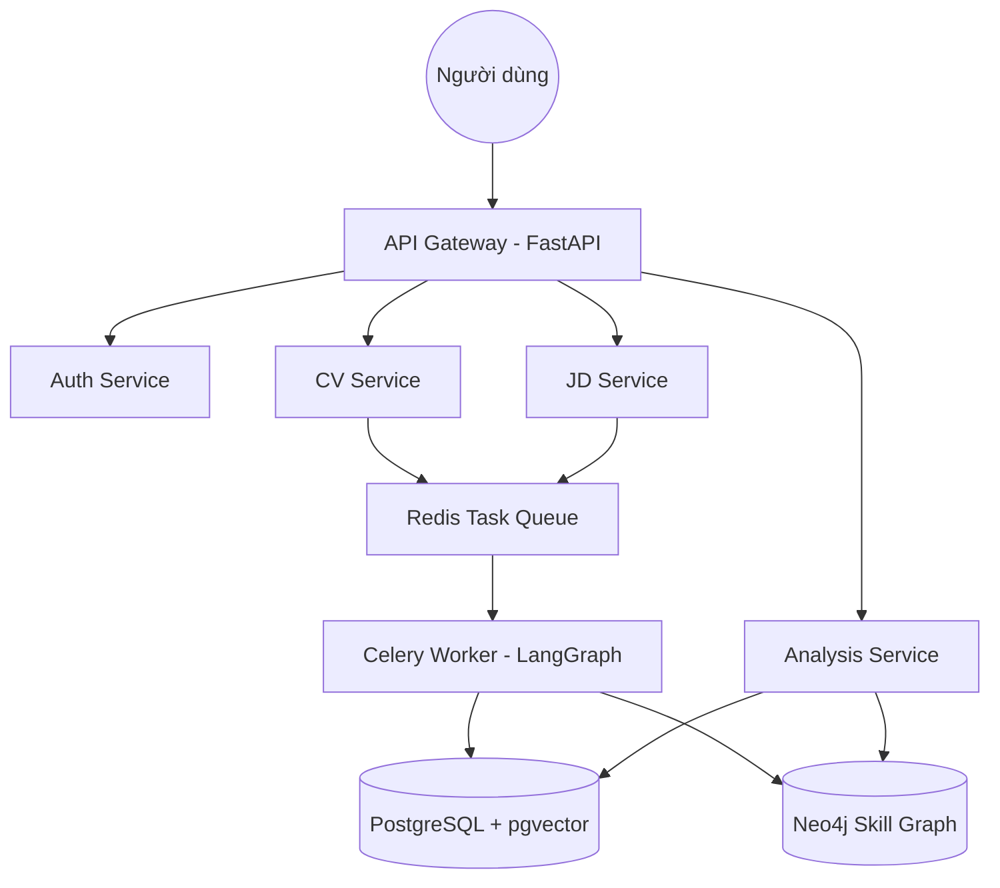

# Dự án Phân Tích Khoảng Trống Kỹ Năng (Demo)

Hệ thống phân tích khoảng trống kỹ năng và gợi ý lộ trình nghề nghiệp thông minh dựa trên AI, Graph tri thức (Neo4j) và Vector Search (PostgreSQL + pgvector).

---

## 🏗 Kiến trúc Hệ thống

Dự án được xây dựng theo kiến trúc **Microservices** để đảm bảo tính mở rộng và khả năng xử lý độc lập các tác vụ nặng (AI/OCR).

### Sơ đồ luồng hoạt động


### Các thành phần chính
- **API Gateway**: Điểm tiếp nhận duy nhất, quản lý định tuyến và xác thực.
- **Auth Service**: Quản lý tài khoản, phân quyền và JWT.
- **CV Service**: Tiếp nhận file CV (PDF/Ảnh), quản lý hồ sơ người dùng.
- **JD Service**: Thu thập và quản lý các yêu cầu công việc (Job Descriptions).
- **Analysis Service**: Bộ máy tính toán điểm tương đồng, xác định kỹ năng thiếu hụt (Gap).
- **Worker (LangGraph)**: Xử lý các tác vụ AI không đồng bộ (bóc tách kỹ năng từ CV/JD bằng LLM).

---

## 🚀 Tính năng nổi bật
*   **AI CV Parsing**: Tự động chuyển đổi CV (kể cả dạng ảnh scan) thành dữ liệu kỹ năng có cấu trúc.
*   **Skill Graph Reasoning**: Sử dụng đồ thị để hiểu mối quan hệ giữa các công nghệ (ví dụ: biết React thường cần biết JavaScript).
*   **Semantic Matching**: So khớp kỹ năng dựa trên ý nghĩa (Vector Search), không chỉ là từ khóa thô.
*   **Gợi ý lộ trình (Roadmap)**: Đề xuất các khóa học và bước đi cụ thể để lấp đầy khoảng trống kỹ năng.

---

## 🛠 Hướng dẫn Cài đặt & Chạy dự án

### 1. Chuẩn bị
- Docker & Docker Compose
- Python 3.9+
- OpenAI API Key (Cấu hình trong file `.env`)

### 2. Khởi tạo Hạ tầng (Infrastructure)
Chạy lệnh sau tại thư mục gốc để khởi động các Database và Services:

```bash
cd backend
docker-compose up -d --build
```

### 3. Cấu hình Môi trường
Sao chép file mẫu và điền các API Key cần thiết:
```bash
cp .env.example .env
```
*Lưu ý: Đảm bảo `POSTGRES_HOST=localhost` nếu bạn chạy các script seed từ máy vật lý.*

### 4. 🧬 Hướng dẫn nạp Dữ liệu mẫu (Seeding)
Để hệ thống có sẵn dữ liệu về Công việc và Khóa học, bạn cần chạy script seed:

```bash
# Di chuyển vào thư mục backend
cd backend

# Cài đặt thư viện (nếu chưa có)
pip install -r requirements.txt

# Nạp dữ liệu Tri thức, Công việc và Khóa học
python scripts/seed_data.py
```

### 5. 🔑 Khởi tạo tài khoản Quản trị (Admin)
Hệ thống cần ít nhất một tài khoản Admin để quản lý dữ liệu:

```bash
# Thay đổi email và password theo ý muốn
python scripts/create_admin.py --email admin@demo.ai --password Admin@123
```

---

## 📁 Cấu trúc thư mục Chính
```text
├── backend/
│   ├── gateway/           # API Gateway Service
│   ├── services/          # Các microservices (Auth, CV, JD, Analysis...)
│   ├── worker/            # Celery Worker xử lý LangGraph Agents
│   ├── shared/            # Model dữ liệu và logic dùng chung
│   ├── scripts/           # Script nạp dữ liệu (Seeding) và Admin
│   └── docker-compose.yml # Cấu hình Docker toàn hệ thống
├── frontend/
│   ├── src/app/           # Next.js App Router (UI/UX)
│   └── src/components/    # Thư viện UI Components
└── dataset/               # Dữ liệu mẫu (JSON) cho việc Seeding
```

---

## 📊 AI Logging
Dự án được tích hợp cơ chế Logging tự động các Prompt AI. Thông tin chi tiết về cách quản lý và xem Log có thể tìm thấy tại [AGENTS.md](./AGENTS.md).
