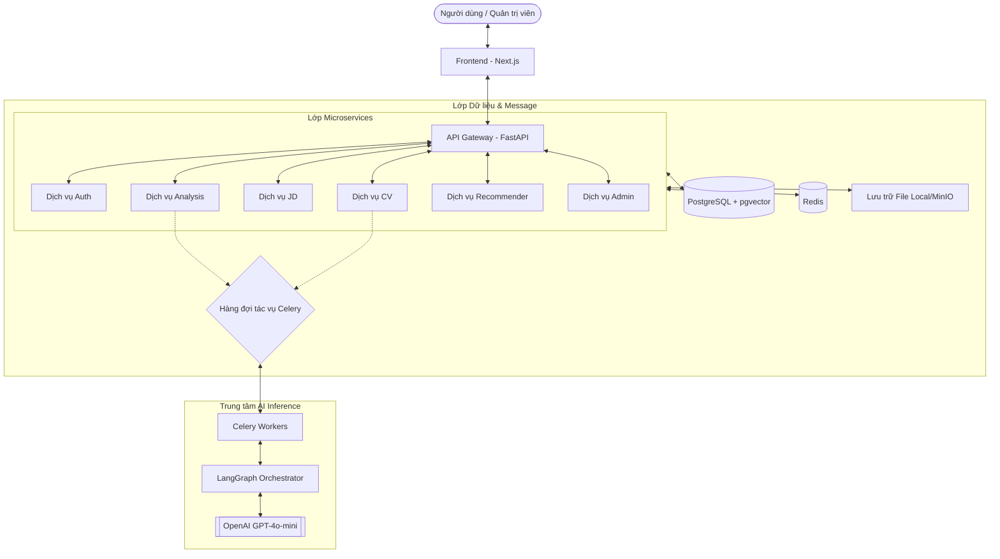
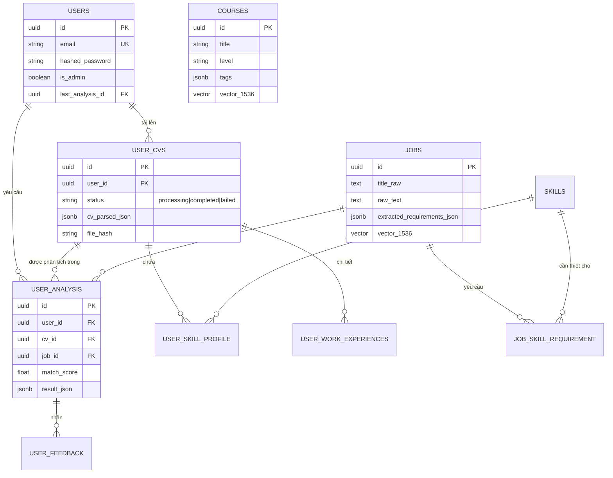
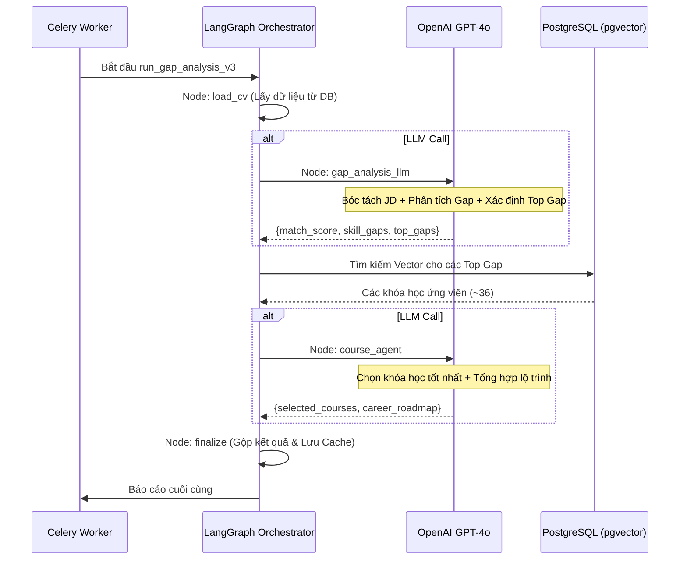

# AI Career Advisor (Lumix AI) — Kiến trúc hệ thống

> **Dự án:** Nền tảng Tư vấn Sự nghiệp dựa trên AI
> **Công nghệ lõi:** Next.js, FastAPI, PostgreSQL (pgvector), Redis, Celery, LangGraph, OpenAI GPT-4o.

---

## 1. Tóm tắt dự án

Lumix AI là một nền tảng tư vấn sự nghiệp AI tiên tiến, tận dụng các Mô hình Ngôn ngữ Lớn (LLM) và Tìm kiếm Vector để cung cấp hướng dẫn nghề nghiệp cá nhân hóa. Hệ thống bóc tách CV của người dùng, phân tích khoảng cách kỹ năng so với các mô tả công việc (JD) thực tế, và tạo ra lộ trình học tập tùy chỉnh kèm theo các đề xuất khóa học.

---

## 2. Kiến trúc tổng thể

Hệ thống tuân theo kiến trúc microservices, được điều phối bởi một API Gateway tập trung và vận hành bởi một pipeline xử lý AI bất đồng bộ.



---

## 3. Các thành phần cốt lõi

### 3.1 API Gateway
- **Công nghệ chính:** FastAPI
- **Nhiệm vụ:** Điều hướng (Reverse proxying), quản lý CORS, và tiêm (inject) thông tin xác thực.
- **Bảo mật:** Xác thực token JWT và tiêm các header `X-User-ID`, `X-User-Email`, và `X-Is-Admin` vào các yêu cầu gửi đến các microservice phía sau.

### 3.2 Microservices
| Dịch vụ | Nhiệm vụ chính |
|---|---|
| **Auth Service** | Đăng ký, đăng nhập, quản lý hồ sơ người dùng và cấp phát JWT. |
| **CV Service** | Tải lên file CV, quản lý bóc tách và CRUD hồ sơ kỹ năng. |
| **JD Service** | Thu thập JD, nhập JD thủ công và tìm kiếm việc làm dựa trên vector. |
| **Analysis Service** | Điều phối phân tích khoảng cách, tạo lộ trình sự nghiệp và vòng lặp phản hồi. |
| **Recommender Service** | Quản lý cơ sở dữ liệu khóa học và công cụ đề xuất ngữ nghĩa. |
| **Admin Service** | Cài đặt hệ thống, giám sát và các quyền điều khiển quản trị. |

---

## 4. Kiến trúc dữ liệu

### 4.1 Sơ đồ thực thể - quan hệ (ERD)



---

## 5. AI Pipelines (v3 — LangGraph)

Nền tảng sử dụng các tác nhân AI (AI Agents) tinh vi được điều phối qua LangGraph để thực hiện suy luận toàn diện.

### 5.1 Pipeline bóc tách CV (CV Parsing)
Chuyển đổi tài liệu PDF/Ảnh thô thành hồ sơ JSON có cấu trúc.
1. **Trích xuất**: Phương pháp hybrid (Trích xuất văn bản trực tiếp → Fallback OCR).
2. **Ẩn danh PII**: Che các thông tin nhạy cảm trước khi xử lý bằng LLM.
3. **Bóc tách LLM**: GPT-4o-mini trích xuất kỹ năng, kinh nghiệm và học vấn vào định dạng có cấu trúc.
4. **Chuẩn hóa**: Ánh xạ các kỹ năng vào danh mục kỹ năng nội bộ.

### 5.2 Pipeline Phân tích Khoảng cách & Lộ trình
Quy trình tối ưu hóa với 2 lần gọi LLM để đạt độ chính xác và hiệu suất tối đa.



---

## 6. Môi trường & Hạ tầng

### 6.1 Chiến lược triển khai
- **Container hóa**: Docker & Docker Compose.
- **Workers**: Các worker Celery xử lý các tác vụ AI nặng một cách bất đồng bộ.
- **Caching**: Lưu trữ đệm Redis đa lớp cho các phản hồi từ LLM và kết quả phân tích khoảng cách.

### 6.2 Các cờ cấu hình chính
| Cờ (Flag) | Mặc định | Mục đích |
|---|---|---|
| `USE_LLM_GAP_AGENT` | `true` | Kích hoạt phân tích v3 LangGraph thay vì engine vector cũ. |
| `GAP_LLM_MODEL` | `gpt-4o-mini` | Chỉ định mô hình suy luận chính. |
| `GAP_CACHE_TTL` | `1800` | Thời gian lưu cache Redis cho kết quả phân tích (30 phút). |
| `GAP_PII_MASKING` | `true` | Đảm bảo quyền riêng tư dữ liệu trong log và prompt LLM. |

---

## 7. Cấu trúc thư mục dự án

```text
backend/
├── gateway/         # FastAPI Gateway & Auth Middleware
├── services/        # Các Microservice theo domain
│   ├── auth_service/
│   ├── cv_service/
│   ├── jd_service/
│   ├── analysis_service/
│   └── recommender_service/
├── worker/          # Celery Worker & LangGraph Agents
│   ├── tasks/       # Định nghĩa các tác vụ chạy nền
│   └── langgraph_agents/
│       └── gap_v3/  # Đồ thị phân tích Gap toàn diện
├── shared/          # DB Models, LLM Utils, Shared Schemas
└── scripts/         # Scripts gieo dữ liệu (Seeder) & Migration
```
