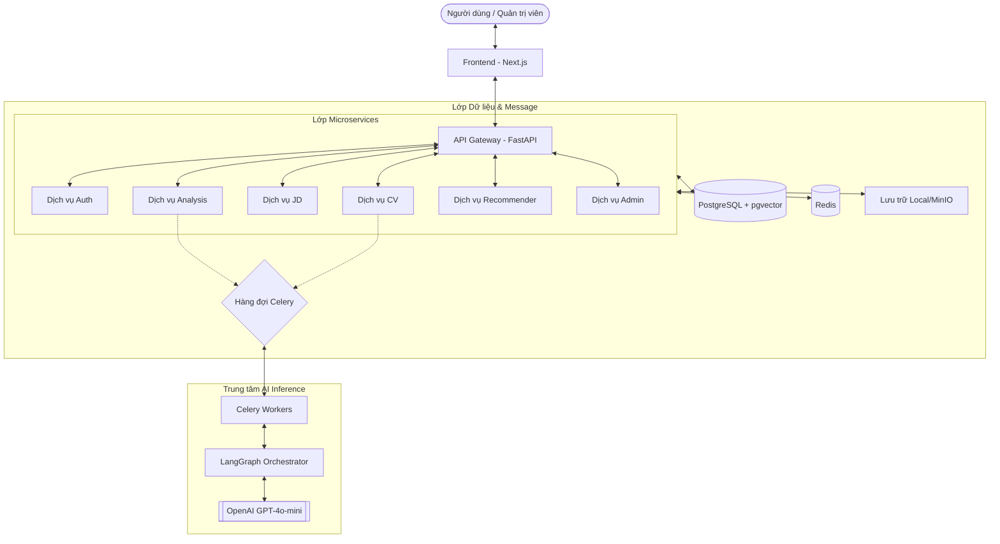

# 🏗️ KIẾN TRÚC TỔNG THỂ & CÔNG NGHỆ - LUMIX AI

> **Dự án:** Nền tảng Tư vấn Nghề nghiệp AI (Lumix AI)
> **Phiên bản:** 2.0 (Production Ready)
> **Ngôn ngữ:** Tiếng Việt
> **Ngày cập nhật:** 25/04/2026

---

## 1. TỔNG QUAN & SỨ MỆNH

### 1.1 Sứ mệnh Dự án
**Lumix AI** ra đời với mục tiêu hiện đại hóa trải nghiệm tư vấn nghề nghiệp bằng cách tận dụng AI tiên tiến để:
- 📄 **Phân tích CV** tự động từ file PDF/ảnh với độ chính xác cao.
- 🎯 **So khớp kỹ năng** thông minh dựa trên ngữ cảnh thị trường thực tế.
- 🗺️ **Kiến tạo lộ trình** học tập cá nhân hóa để tối đa hóa giá trị ứng viên.
- 💰 **Dự báo tăng trưởng** về thu nhập và khả năng trúng tuyển.

### 1.2 Đặc điểm nổi bật
- ✅ **Kiến trúc Microservices** - Dễ mở rộng và bảo trì.
- ✅ **AI-Powered** - Sử dụng GPT-4o-mini và LangGraph (v3).
- ✅ **Vector Search** - Tìm kiếm thông minh với pgvector (1536 dims).
- ✅ **Xử lý bất đồng bộ** - Celery workers cho các tác vụ nặng (Parsing, Analysis).
- ✅ **Bảo mật chuẩn Enterprise** - JWT, Rate Limiting, PII Masking, Encrypted Sessions.

---

## 2. KIẾN TRÚC HỆ THỐNG

### 2.1 Sơ đồ kiến trúc cấp cao
Hệ thống tuân theo mô hình **API Gateway + Microservices** phối hợp với pipeline AI Agentic.

### 2.2 Các thành phần chính
1.  **Frontend Layer**: Next.js 14, TailwindCSS, Shadcn/UI. Xử lý giao diện người dùng và quản lý trạng thái client.
2.  **API Gateway**: FastAPI đóng vai trò Reverse Proxy, quản lý CORS, Rate Limiting và xác thực JWT.
3.  **Microservices**: Các dịch vụ độc lập xử lý logic nghiệp vụ riêng biệt (Auth, CV, JD, Analysis, Recommender, Admin).
4.  **Worker Layer**: Celery xử lý các tác vụ AI nền, sử dụng Redis làm Broker.
5.  **AI Engine**: LangGraph điều phối các tác nhân AI (Agents) để thực hiện bóc tách CV và phân tích Gap Analysis toàn diện (Holistic Reasoning).

---

## 3. CÔNG NGHỆ CHI TIẾT

### 3.1 Backend Stack
- **FastAPI**: Web framework tốc độ cao, hỗ trợ async native.
- **SQLAlchemy 2.0**: ORM mạnh mẽ với hỗ trợ Connection Pooling (pool_size=10).
- **Celery 5.4**: Xử lý hàng đợi tác vụ với 4 hàng đợi chuyên biệt (parsing, analysis, crawler, default).
- **Redis 7**: Cache kết quả LLM, quản lý session mã hóa (Fernet) và Broker cho Celery.

### 3.2 Database & Search
- **PostgreSQL 15**: Cơ sở dữ liệu chính.
- **pgvector**: Thực hiện tìm kiếm tương đồng vector cho công việc và khóa học.
- **Tối ưu hóa**: Hệ thống sử dụng 9 index quan trọng để đảm bảo tốc độ truy vấn < 100ms.

### 3.3 AI & Machine Learning
- **LangGraph**: Framework điều phối AI Agent theo đồ thị trạng thái.
- **OpenAI GPT-4o-mini**: LLM chính cho việc bóc tách và suy luận.
- **GrowthCalculator**: Module tính toán tác động mức lương (+%) và độ khớp (+%) dựa trên trọng số thực tế từ database.

---

## 4. BẢO MẬT & HIỆU NĂNG

### 4.1 Bảo mật Đa lớp
- **JWT Hardening**: Bắt buộc Secret Key 32+ ký tự, ngăn chặn giả mạo token.
- **Admin Verification**: Xác thực đa lớp (JWT + Database check), không tin tưởng header đơn thuần.
- **PII Masking**: Tự động ẩn danh thông tin cá nhân (Tên, Email, SĐT) trước khi gửi dữ liệu đến LLM.
- **SQL Safety**: Ngăn chặn SQL Injection thông qua module tập trung và sử dụng Bind Parameters.
- **Redis Encryption**: Mã hóa dữ liệu nhạy cảm trong Redis bằng AES-128.

### 4.2 Tối ưu Hiệu năng
- **Connection Pooling**: Tăng khả năng chịu tải cho Database.
- **Multi-layer Caching**: Cache kết quả phân tích (TTL 30 phút) và phản hồi LLM.
- **Parallel Processing**: Sử dụng `asyncio.gather` cho các tác vụ tìm kiếm song song (YouTube + Course Search).

---

## 5. LUỒNG DỮ LIỆU CHÍNH

### 5.1 Pipeline Bóc tách CV
1.  **Extract**: Trích xuất text từ file PDF/Ảnh (Direct/OCR).
2.  **Masking**: Ẩn danh PII.
3.  **Parsing**: LLM bóc tách thành cấu trúc JSON (Skills, Work History, Education).
4.  **Persist**: Lưu vào DB (`cv_parsed_json`) để tái sử dụng.

### 5.2 Pipeline Phân tích Khoảng cách (Gap Analysis)
1.  **Load Context**: Nạp dữ liệu CV đã bóc tách và yêu cầu JD.
2.  **Holistic Reasoning**: LLM phân tích độ phù hợp tổng thể dựa trên toàn bộ ngữ cảnh (Kinh nghiệm, Cấp bậc, Kỹ năng).
3.  **Growth Calculation**: Tính toán impact thực tế từ dữ liệu thị trường.
4.  **Synthesis**: Tạo lộ trình học tập và đề xuất khóa học.

---

**Tài liệu liên quan:**
- `FEATURES.md` - Chi tiết chức năng và lộ trình phát triển.
- `PROJECT_REPORTS.md` - Báo cáo hoàn thành và lịch sử sửa lỗi.
- `DEPLOYMENT.md` - Hướng dẫn triển khai Production.
